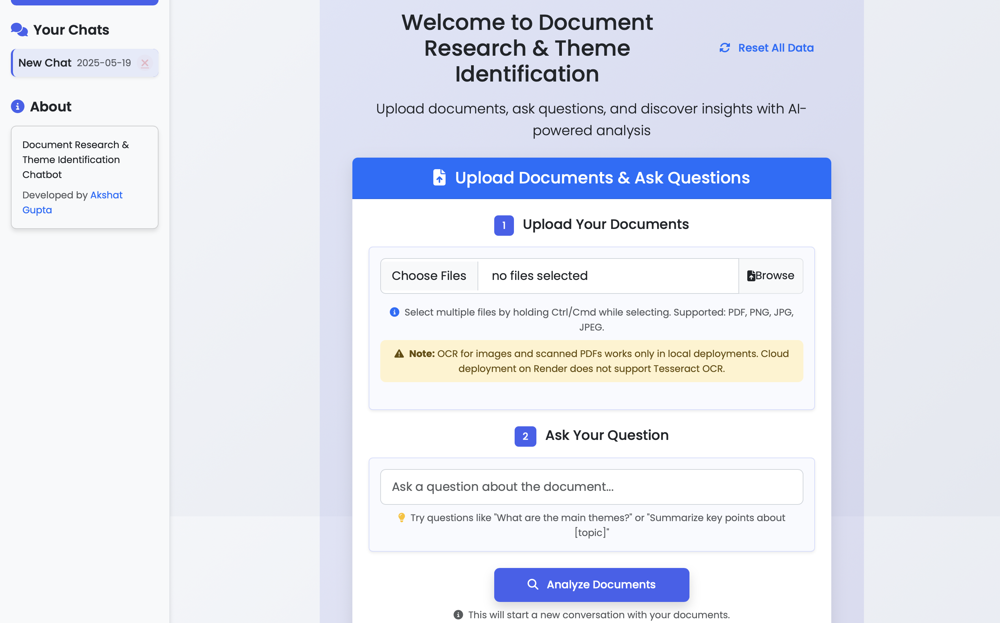
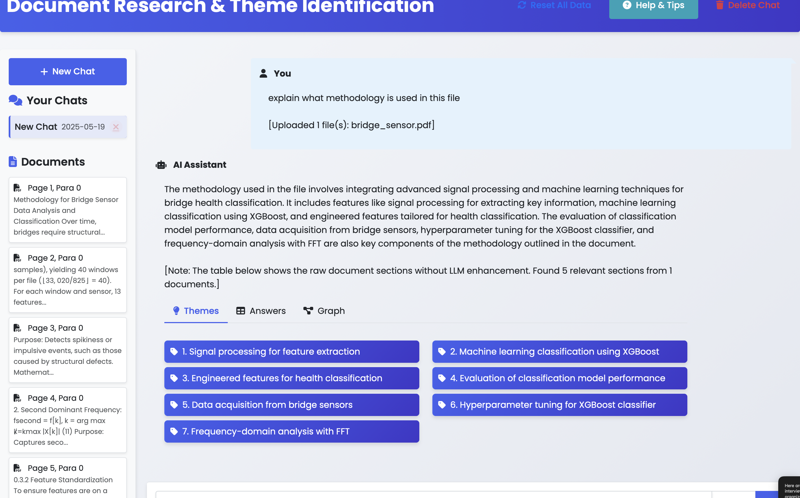

# Document Research & Theme Identification Chatbot

[](https://github.com/Akshat-Gupta04/wasserstoff-AiInternTask)


A comprehensive Flask-based web application for document analysis, theme identification, and knowledge graph visualization. Developed by Akshat Gupta, this application allows users to upload multiple documents, ask questions about their content, and explore the relationships between themes and information through interactive visualizations. The application is optimized for deployment on Render with in-memory document processing and efficient resource usage.

##  Screenshots and Video demo

### Homepage


### Results and Knowledge Graph


## �📋 Table of Contents

- [Features](#-features)
- [System Architecture](#-system-architecture)
- [Methodology](#-methodology)
- [Installation](#-installation)
- [Usage](#-usage)
- [Deployment](#-deployment)
  - [OCR on Render](#ocr-on-render)
- [Technologies Used](#-technologies-used)
- [Project Structure](#-project-structure)
- [Hybrid Retrieval System](#-hybrid-retrieval-system)
- [License](#-license)
- [Developer](#-developer)

## ✨ Features

- **Multi-Document Processing**: Upload and analyze multiple PDF and image files simultaneously
- **Advanced Text Extraction**: Combines PyMuPDF, pdfplumber, and Tesseract OCR for robust text extraction
- **Semantic Search**: Vector embeddings with OpenAI's text-embedding-3-small model
- **Hybrid Retrieval System**: Natural retrieval of document sections with LLM-enhanced summaries
- **Theme Identification**: Automatic discovery of key themes using NMF and TF-IDF with LLM refinement
- **Knowledge Graph Visualization**: Interactive graph showing relationships between documents and themes
- **Continuous Chat Interface**: Ask follow-up questions while maintaining context
- **Multiple Chat Sessions**: Create and manage separate research sessions with complete isolation
- **Detailed Citations**: Answers include specific document, page, and paragraph citations
- **Responsive Design**: Works on desktop, tablet, and mobile devices
- **Processing Animations**: Visual feedback during document analysis and query processing
- **Session Isolation**: Each chat session has separate vector databases, themes, and document storage

## 🏗 System Architecture

The application follows a modular architecture with the following components:

1. **Frontend Layer**:
   - HTML/CSS/JavaScript interface with Bootstrap 5
   - Interactive visualizations using Plotly
   - Dynamic animations for processing feedback
   - Responsive design for all device sizes

2. **Application Layer**:
   - Flask web framework for routing and request handling
   - Session management for multiple chat contexts
   - Document processing pipeline
   - Query processing and response generation

3. **Data Processing Layer**:
   - Text extraction from multiple document formats
   - Vector embedding generation
   - Theme identification using NMF
   - Knowledge graph construction

4. **Storage Layer**:
   - SQLite database for document text and metadata
   - ChromaDB for vector embeddings and semantic search
   - Session-specific data isolation

## 🔍 Methodology

### Document Processing

1. **Text Extraction**:
   - Primary: PyMuPDF for direct text extraction from PDFs
   - Secondary: pdfplumber as an alternative PDF text extractor
   - Tertiary: OCR using pytesseract for image-based or scanned documents

2. **Text Processing**:
   - Splits text into paragraphs for granular analysis
   - Filters out short or empty paragraphs
   - Normalizes whitespace and formatting

3. **Vector Embedding**:
   - Generates embeddings using OpenAI's text-embedding-3-small
   - Stores embeddings in ChromaDB for semantic search
   - Includes metadata for citation tracking

### Query Processing

1. **Semantic Search**:
   - Generates vector embedding for the query
   - Performs similarity search against document embeddings
   - Retrieves the most semantically relevant paragraphs

2. **Hybrid Ranking**:
   - Combines results from semantic and keyword search
   - Weights and normalizes scores for balanced retrieval
   - Ensures both semantic meaning and keyword relevance are considered

3. **Hybrid Retrieval System**:
   - Uses natural retrieval to display raw document sections in the results table
   - Preserves original document text without LLM processing
   - Provides proper citations with document name, page number, and paragraph number

4. **LLM-Enhanced Summary**:
   - Uses OpenAI's GPT model to generate an easy-to-understand summary
   - Helps users quickly grasp key information from retrieved documents
   - Clearly separates LLM-enhanced content from raw document sections

### Theme Identification

1. **Vectorization**:
   - Applies TF-IDF vectorization to identify important terms
   - Uses Non-negative Matrix Factorization (NMF) for topic modeling
   - Optimizes number of topics based on coherence scores
   - Handles both small and large document collections effectively

2. **LLM Theme Refinement**:
   - Uses LLM to refine raw statistical themes into coherent concepts
   - Considers query context to ensure themes are relevant to user questions
   - Produces concise, human-readable theme descriptions
   - Makes complex document relationships more understandable

3. **Knowledge Graph Construction**:
   - Creates a directed graph using NetworkX
   - Represents documents and themes as nodes
   - Establishes weighted edges based on document-theme relationships
   - Marks query-relevant documents with special attributes
   - Provides interactive filtering and exploration capabilities

## 🚀 Installation

### Prerequisites

- Python 3.8 or higher
- pip (Python package manager)
- OpenAI API key
- Tesseract OCR (optional, for image and scanned PDF processing)
  - Note: OCR functionality requires Tesseract to be installed on your system
  - OCR will not work in cloud deployments on Render due to compatibility issues

### Setup

1. Clone the repository:
   ```bash
   git clone https://github.com/Akshat-Gupta04/wasserstoff-AiInternTask.git
   cd wasserstoff-AiInternTask
   ```

2. Create and activate a virtual environment:
   ```bash
   python -m venv venv
   source venv/bin/activate  # On Windows: venv\Scripts\activate
   ```

3. Install dependencies:
   ```bash
   pip install Flask==3.1.0 Flask-Cors==5.0.0 python-dotenv==1.0.1 langchain==0.3.14 langchain-community langchain-openai openai gunicorn==20.1.0
   pip install -r requirements.txt
   ```

4. Install Tesseract OCR:
   - On macOS: `brew install tesseract`
   - On Ubuntu: `sudo apt-get install tesseract-ocr`
   - On Windows: Download and install from [GitHub](https://github.com/UB-Mannheim/tesseract/wiki)

5. Create a `.env` file in the project root with your OpenAI API key:
   ```
   OPENAI_API_KEY=your_api_key_here
   ```

6. Create necessary directories:
   ```bash
   mkdir -p uploads data static/graphs
   ```

7. Run the application:
   ```bash
   python app.py --port 3000
   ```

8. Open your browser and navigate to:
   ```
   http://127.0.0.1:3000
   ```

   Note: The application will automatically select an available port if not specified.

## 📖 Usage

### Uploading Documents

1. On the home page, click the "Browse" button to select documents
2. Hold Ctrl/Cmd to select multiple files (PDF, PNG, JPG, JPEG supported)
3. Enter your initial question in the text field
4. Click "Analyze Documents" to process the files and start a new chat session

### Asking Questions

1. Type your question in the input field at the bottom of the chat interface
2. Click the send button or press Enter to submit your question
3. View the response, which includes:
   - An LLM-enhanced summary that helps you understand the key information
   - Key themes identified in the relevant documents with LLM refinement
   - A knowledge graph showing relationships between documents and themes
   - A table of raw document sections with detailed citations (document name, page, paragraph)
   - Clear separation between LLM-enhanced content and raw document sections

### Using the Knowledge Graph

1. Click the "Graph" tab to view the knowledge graph
2. Use the dropdown menu to filter by relevance or specific themes
3. Hover over nodes to see detailed information
4. Click the fullscreen button for a larger view
5. Zoom and pan to explore complex graphs

### Managing Sessions

1. Create a new chat session by clicking "New Chat" in the sidebar
2. Switch between existing sessions by clicking on them in the sidebar
3. Delete a session by clicking the "×" button next to its name

## 🚢 Deployment

This application is configured for easy deployment on Render.com and other cloud platforms.

### Deploying to Render

1. **Create a Render account**:
   - Sign up at [render.com](https://render.com)

2. **Connect your GitHub repository**:
   - In the Render dashboard, click "New" and select "Web Service"
   - Connect to your GitHub repository

3. **Configure the service**:
   - Name: `document-research-chatbot` (or your preferred name)
   - Environment: `Python 3`
   - Build Command: `pip install -r requirements.txt`
   - Start Command: `gunicorn app:app --bind 0.0.0.0:$PORT --workers=2 --threads=4 --timeout=120`
   - Select the appropriate instance type (at least 512MB RAM recommended)

4. **Add environment variables**:
   - `OPENAI_API_KEY`: Your OpenAI API key
   - `FLASK_DEBUG`: `0`
   - `GUNICORN_TIMEOUT`: `120`
   - `GUNICORN_WORKERS`: `2`
   - `GUNICORN_THREADS`: `4`

5. **Deploy**:
   - Click "Create Web Service"
   - Render will automatically build and deploy your application

### Using render.yaml (Recommended)

This repository includes a `render.yaml` file for Blueprint deployments:

1. Fork this repository to your GitHub account
2. In Render, click "New" and select "Blueprint"
3. Connect to your forked repository
4. Render will automatically configure all services based on the render.yaml file
5. Add your `OPENAI_API_KEY` when prompted
6. Click "Apply" to deploy

### Data Persistence

The application is configured to store all data in a persistent disk on Render:

- **Disk Configuration**: A 10GB disk is mounted at `/data` to store:
  - SQLite database (`documents.db`)
  - ChromaDB vector database
  - Uploaded documents
  - Generated graphs

- **Environment Variables**: The application uses these paths:
  - `DATA_FOLDER=/data`: Main data directory
  - `UPLOAD_FOLDER=/data/uploads`: Document storage
  - `STATIC_FOLDER=static`: Static assets (CSS, JS, etc.)

- **Backup Considerations**:
  - The persistent disk is backed up according to your Render plan
  - For additional safety, consider implementing scheduled backups
  - Critical data is isolated in the `/data` directory for easy backup

### OCR on Render

The application supports OCR using Tesseract:

- **Tesseract OCR** (system installation)
  - Not compatible with Render's environment
  - OCR functionality will not work in cloud deployments on Render
  - Works properly when running the application locally with Tesseract installed

#### OCR Limitations on Render

Due to Render's environment constraints:

- OCR functionality is disabled in cloud deployments
- The application will still process PDFs using PyMuPDF and pdfplumber
- Text extraction will be limited to directly embedded text in PDFs
- Image-only PDFs and image files will have limited text extraction capabilities

#### Using OCR Locally

To use OCR functionality:
- Download the code and run it locally
- Install Tesseract OCR on your system
- The application will automatically detect and use Tesseract
- All OCR features will work properly in local deployments

### Verifying Deployment

- The application includes a `/health` endpoint that checks:
  - Database connection
  - Vector database (ChromaDB) status
  - OpenAI API configuration
- Use this endpoint to monitor the health of your deployment
- Add this endpoint to your monitoring system for alerts

### Scaling Considerations

- **Worker Configuration**: The application uses Gunicorn with:
  - 2 worker processes for handling concurrent requests
  - 4 threads per worker for improved throughput
  - 120-second timeout for long-running operations

- **Memory Usage**:
  - Each worker requires approximately 200-250MB of RAM
  - The application is optimized to work within Render's 512MB memory limit
  - In-memory document processing helps reduce memory usage
  - The application implements periodic cache clearing to manage memory

- **Storage Requirements**:
  - Vector databases grow with document count
  - The application processes documents in memory to reduce storage requirements
  - Consider increasing resources for large document collections

## 🛠 Technologies Used

- **Backend**:
  - Flask 3.1.0: Web framework
  - Gunicorn 20.1.0: WSGI HTTP Server for production
  - SQLite: Relational database
  - ChromaDB: Vector database
  - LangChain 0.3.14: Framework for LLM applications
  - OpenAI API: Embeddings and LLM capabilities
  - PyMuPDF & pdfplumber: PDF processing
  - pytesseract: OCR engine for images and scanned documents
  - scikit-learn: NMF and TF-IDF for theme identification
  - NetworkX: Graph construction and analysis
  - NLTK: Natural language processing

- **Frontend**:
  - HTML5/CSS3/JavaScript
  - Bootstrap 5: UI framework
  - Plotly.js: Interactive knowledge graph visualizations
  - Font Awesome: Icons
  - Animate.css: Animations for document processing
  - AJAX: Asynchronous document processing and chat

## 📁 Project Structure

```
document-research-chatbot/
├── app.py                  # Main Flask application with hybrid retrieval system
├── wsgi.py                 # WSGI entry point for Gunicorn
├── requirements.txt        # Python dependencies
├── Procfile                # Process file for Heroku/Render
├── render.yaml             # Render deployment configuration
├── runtime.txt             # Python version specification
├── README.md               # Project documentation
├── .env                    # Environment variables (not in repo)
├── .gitignore              # Git ignore file
├── static/
│   ├── css/
│   │   └── style.css       # Custom styles
│   ├── js/
│   │   ├── main.js         # Main JavaScript
│   │   ├── new-animation.js # Processing animations
│   │   ├── ajax-document-analysis.js # AJAX for document processing
│   │   ├── ajax-chat.js    # AJAX for chat functionality
│   │   └── analysis-animation.js # Analysis animations
│   └── knowledge_graph_*.html # Generated knowledge graphs
├── templates/
│   └── index.html          # Main application template
├── uploads/                # Session-specific uploaded documents (not in repo)
└── data/
    ├── documents.db        # SQLite database for document storage
    └── chroma_db/          # ChromaDB vector database (session-specific)
```

## 🔄 Hybrid Retrieval System

This application implements a hybrid retrieval approach that combines the best of both natural retrieval and LLM enhancement:

### Natural Retrieval
- Raw document sections are retrieved directly from the vector database based on semantic similarity
- Original document text is preserved without LLM processing or summarization
- Detailed citations show exactly where each section comes from (document name, page, paragraph)
- Results table displays the actual document content for maximum transparency

### LLM Enhancement
- Themes are identified using statistical methods (NMF) and refined by LLM for better coherence
- A generalized LLM-enhanced summary helps users understand the key information
- Knowledge graph visualization shows document-theme relationships in an intuitive way
- Clear separation between LLM-enhanced content and raw document sections

This hybrid approach provides both the accuracy and transparency of natural retrieval with the user-friendly understanding that LLM enhancement offers.

## 📄 License

This project is licensed under the MIT License - see the LICENSE file for details.

## 👨‍💻 Developer

Developed by Akshat Gupta as part of the Wasserstoff AI Intern Task.
